# A Guide to the Boreas Dataset

## Introduction

### Purpose

This dataset and the associated benchmarks are intended to support odometry and metric localization for lidar, radar, and vision. In the future, we hope to also be able to provide 3D and 2D object labels. This dataset features repeated traversals over a long period and multiple weather conditions. These changing conditions may be used to benchmark long-term localization capabilities of different sensors or the robustness of various sensor types to adverse weather conditions.

### Sensors

- 128-beam Velodyne Alpha-Prime 3D lidar
- FLIR Blackfly S (5 MP) monocular camera
- Navtech 360$^\circ$ radar
- Applanix POSLV GNSS

### Data Collection

Data was collected during repeated traversals of several routes in Toronto, Canada, across several seasons and multiple weather conditions. Two of these routes are shown below:

| 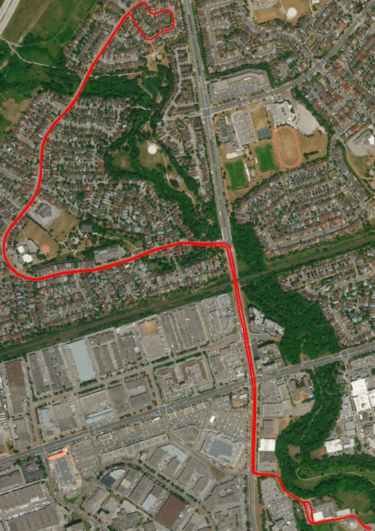 | 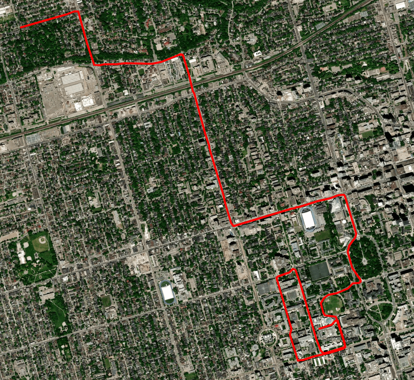 |
| --- | --- |
| [Glen Shields](figs/glen_shields.html) [Video](https://youtu.be/i-S_3qpEYpo) | [St George](figs/st_george.html) [Video](https://youtu.be/HTuleN_KEwY) |

## Sensor Details

### Specifications

The Velodyne Alpha Prime lidar has a 40 degree vertical field of view, with a range of up to 300m for targets with 10\% reflectivity or up to 180m for targets with 5\% reflectivity. This lidar has a 0.2 degree horizontal angular resolution and a 0.1 degree vertical angular resolution. This sensor typically produces over 2M points per second. The lidar is configured to have a rotational rate of 10Hz, resulting in over 200k points per rotation. We retain only the strongest lidar returns instead of keeping dual returns per laser firing sequence.

The Navtech CIR204-H radar has a range resolution of 0.0596m per range bin with a total range of 200.256m. The sensor spins at 4Hz and provides 400 azimuth measurements per rotation, resulting in a horizontal angular resolution of 0.9 degrees.

The FLIR Blackfly S monocular camera has a resolution of 2448 x 2048. Based on the calibration, the camera has a field of view of approximately 81 x 71 degrees. We extract camera images at 10Hz to minimize storage requirements.

The Applanix POSLV system includes an external wheel encoder, and an extra satellite subscription (RTX) which improves the accuracy. All of the logged Applanix data is post-processed using their proprietary POSPac suite. This performs a batch optimization over each sequence. The post-processed position data can be expected to have an RMS error between 5 cm and 20 cm, depending on the sequence. Post-processed data is provided at 200Hz.

### Placement

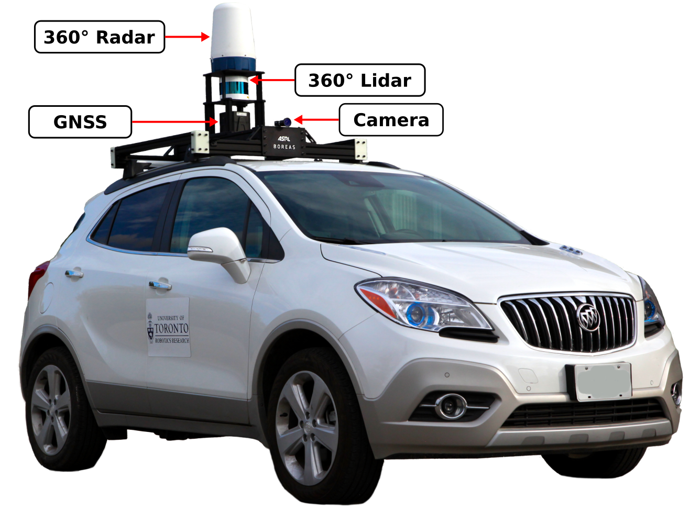

| 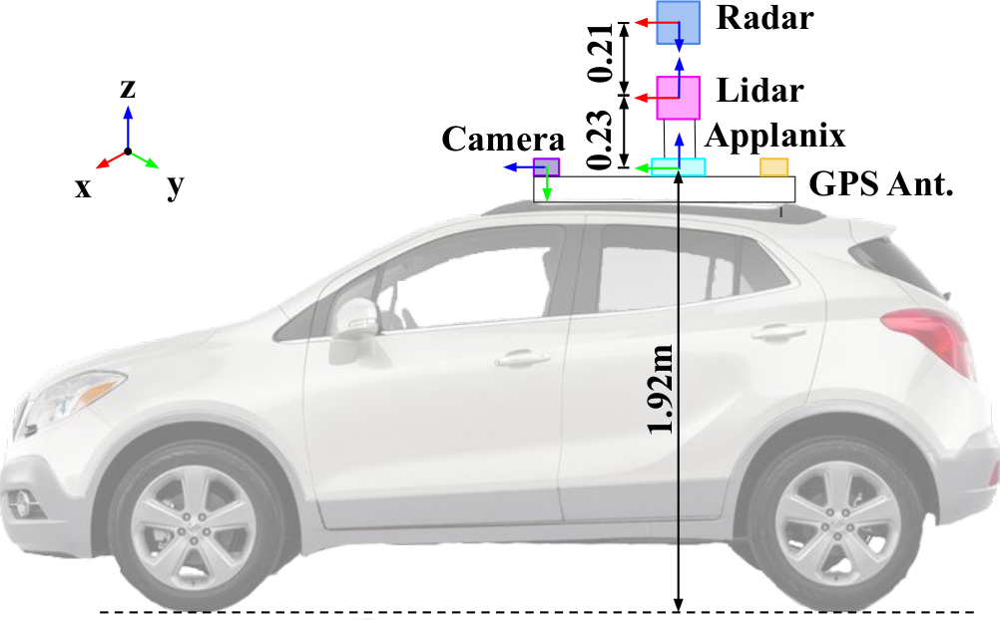](figs/boreas_side.png) | 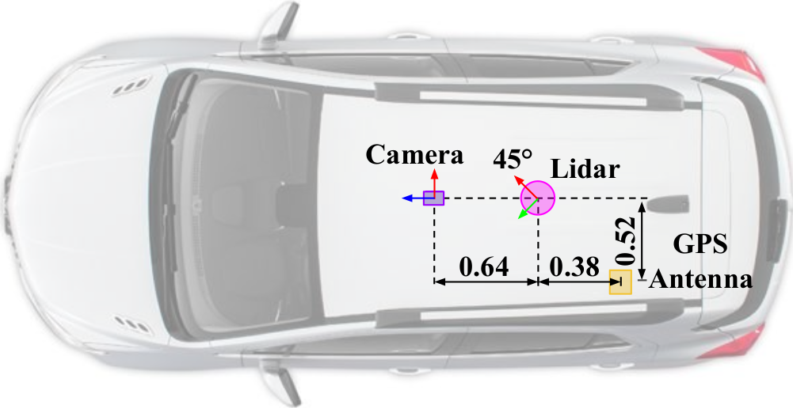](figs/boreas_top.png) |
| --- | --- |

## Data Organization

Each sequence is stored as a folder under a single Amazon S3 bucket and follows the same naming convention: `s3://boreas/boreas-YYYY-MM-DD-HH-MM` denoting the time that data collection started. Below is an overview of the structure of each sequence:

```text
boreas-YYYY-MM-DD-HH-MM
	applanix
		camera_poses.csv
		gps_post_process.csv
		lidar_poses.csv
		radar_poses.csv
	calib
		camera0_intrinsics.yaml
		P_camera.txt
		T_applanix_lidar.txt
		T_camera_lidar.txt
		T_radar_lidar.txt
	camera
		<timestamp>.png
	lidar
		<timestamp>.bin
	radar
		<timestamp>.png
	route.html
	video.pm4
```

Accessing and downloading the dataset is best done using the AWS CLI. The main S3 bucket can also be browsed through using the S3 console in your internet browser at: 

[`https://s3.console.aws.amazon.com/s3/buckets/boreas/`](https://s3.console.aws.amazon.com/s3/buckets/boreas/)

### Download Instructions
1. [Create an AWS account](https://aws.amazon.com/premiumsupport/knowledge-center/create-and-activate-aws-account/)
2. [Install the AWS CLI](https://docs.aws.amazon.com/cli/latest/userguide/install-cliv2.html)
3. Create a `root` folder to store the dataset, example: `/path/to/data/boreas/` Each sequence will then be a folder under `root`.
4. Use the AWS CLI to download either the entire dataset or only the desired sequences and sensors. For example, the following command will download the entire Boreas dataset:

```bash
root=/path/to/data/boreas/
aws s3 sync s3://boreas $root
```

Alternatively, [our website (Work-In-Progress)](boreas.utias.utoronto.ca/#/download) can be used to browse through sequences so as to pick and choose what data to download. The website will then generate a list of AWS CLI commands that can be run as a bash script. These commands will look something like:

```bash
root=/path/to/data/boreas/
cd $root
aws s3 sync s3://boreas/boreas-2020-11-26-13-58 ./boreas-2020-11-26-13-58
```

## Timestamps
The name of each file corresponds to its timestamp. These timestamps are given as the number of microseconds since January 1st, 1970, in UTC time.

For camera images, timestamps are provided at the time that exposure started plus half of the total exposure time. For lidar pointclouds, the timestamp corresponds to the temporal middle of a scan. Each lidar point also has a timestamp associated with it, which corresponds to when each point was measured. For radar scans, the timestamp corresponds to the middle of the scan: `floor(M / 2) - 1` where `M` is the total number of azimuths (400). Each scanned radar azimuth is also timestamped in the same format as the filename.

## Conventions
We follow the convention used at UTIAS for describing rotations, translations, and transformation matrices. See [State Estimation (Barfoot, 2017)](http://asrl.utias.utoronto.ca/~tdb/bib/barfoot_ser17.pdf) for more details.

## File Formats

### Lidar
Lidar pointclouds are stored in a binary format to minimize storage requirements. Each point has six fields: `[x, y, z, i, r, t]` where `(x, y, z)` is the position of the point with respect to the lidar, `i` is the intensity of the reflected infrared signal, `r` is ID of the laser that made the measurement, and `t` is a timestamp. The following code snippet can be used to convert a binary file into a numpy array (N, 6): 

```Python
import numpy as np
from pathlib import Path
def load_lidar(path):
	points = np.fromfile(path, dtype=np.float32).reshape((-1, 6))
	t = float(Path(path).stem) * 1e-6
	points[:, 5] += t
	return points
```

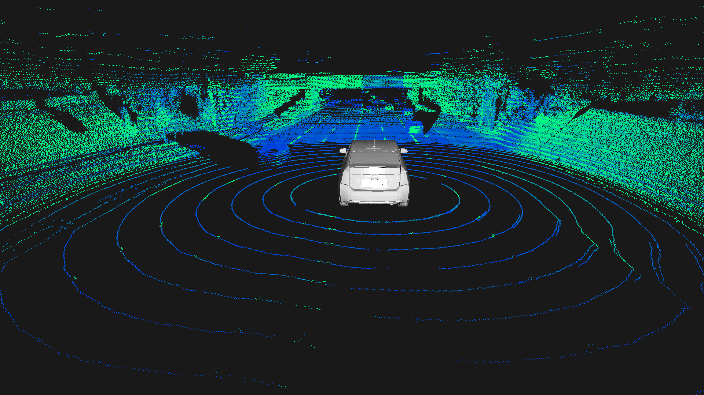

### Radar
Raw radar scans are 2D polar images: `M` azimuths x `R` range bins. We follow Oxford's convention and embed timestamp and encoder information into the first 11 columns (bytes) of each polar radar scan. The first 8 columns represent a 64-bit integer, the UTC timestamp of each azimuth. The next 2 columns represent a 16-bit unsigned integer, the rotational encoder value. The encoder values can be converted into azimuth angles in radians with: `azimuth = encoder * np.pi / 2800`. The next column is unused, preserved compatibility with Oxford's format. For convenience, we also provide a pre-computed cartesian representation of each radar scan with a width of 640 pixels and a resolution of 0.2384 m/pixel.

Polar format:
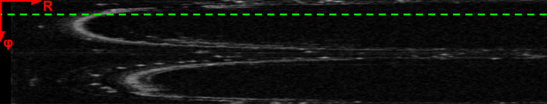
Cartesian format:
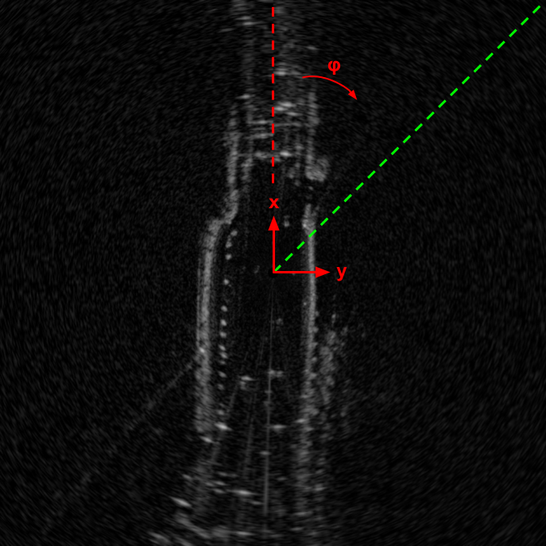

### Camera
Images are simply stored as `png` files. All images are rectified such that a simple projection matrix can be used to project lidar points onto an image.

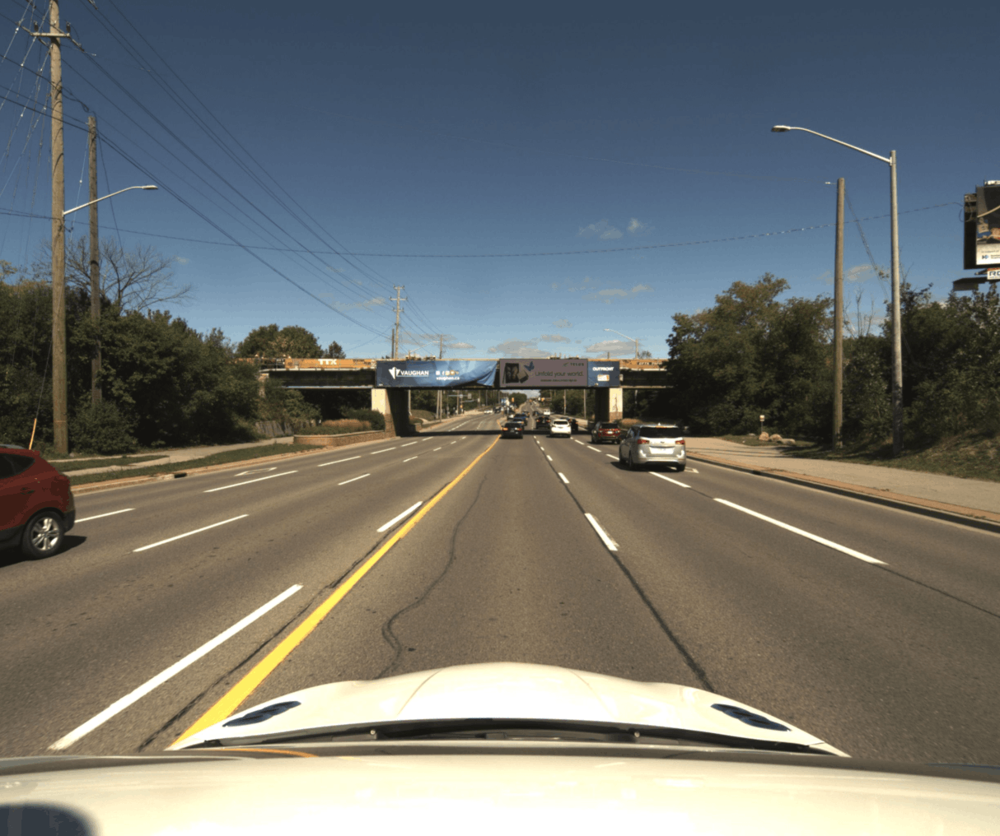

### Pose Files
Each sensor frame's pose information is stored in the associated `applanix/<sensor>_poses.csv` file with the following format:

`t, x, y, z, vx, vy, vz, r, p, y, wz, wy, wx` where `t` is the UTC timestamp in microseconds that matches the file name, `(x, y, z)` is the position of the sensor with repect to the ENU origin frame, as measured in the ENU frame, `(vx, vy, vz)` is the velocity of the sensor with respect to the ENU frame, `(r, p, y)` are the yaw-pitch-roll angles which can be converted into the rotation matrix from the sensor frame to the ENU frame, `(wx, wy, wz)` aer the angular velocities of the sensor with respect to ENU as measured in the sensor frame. The pose of the sensor frame is then:

```Python
import numpy as np
def get_pose(x, y, z, r, p, y)
	T_enu_sensor = np.identity(4, dtype=np.float64)
	C_enu_sensor = yawPitchRollToRot(y, p, r)
	T_enu_sensor[:3, :3] = C_enu_sensor
	r_sensor_enu_in_enu = np.array([x, y, z]).reshape(3,1)
	T_enu_sensor[:3, 3:] = r_sensor_enu_in_enu
	return T_enu_sensor

# Linear and angular velocities
v_sensor_enu_in_enu = [vx, vy, vz]
w_sensor_enu_in_sensor = [wx, wy, wz]
```

## Synchronization and Calibration

### Synchronization
The camera was configured to emit a square-wave pulse where the rising edge of each pulse corresponds to the start of a new camera exposure event. The Applanix receiver was then configured to receive and timestamp these event signals. The Velodyne lidar was synchronized to UTC time using a hardwired connection to the Applanix sensor carrying NMEA data and PPS signals. The data-recording computer was synchronized to UTC time in the same fashion. The Navtech radar synchronizes its local clock to the NTP time broadcasted on its ethernet subnet. Since the computer publishing the NTP time is synchronized to UTC time, the radar is thereby also synchronized to UTC time.

### Camera Intrinsics
Camera intrinsics are calibrated using [MATLAB's camera calibrator](https://www.mathworks.com/help/vision/ug/using-the-single-camera-calibrator-app.html) and are recorded in `camera0_intrinsics.yaml`. Images in the dataset have already been recitified and as such, the intrinsics parameters can be ignored for most applications. The recitified matrix `P`, stored in `P_camera.txt`, can then use used to project points onto the image plane.

### Lidar-to-Camera Extrinsics
The extrinsic calibration between the camera and lidar is obtained using [MATLAB's camera to LIDAR calibrator](https://www.mathworks.com/help/lidar/ug/lidar-and-camera-calibration.html). The results are stored in `T_camera_lidar.txt`.

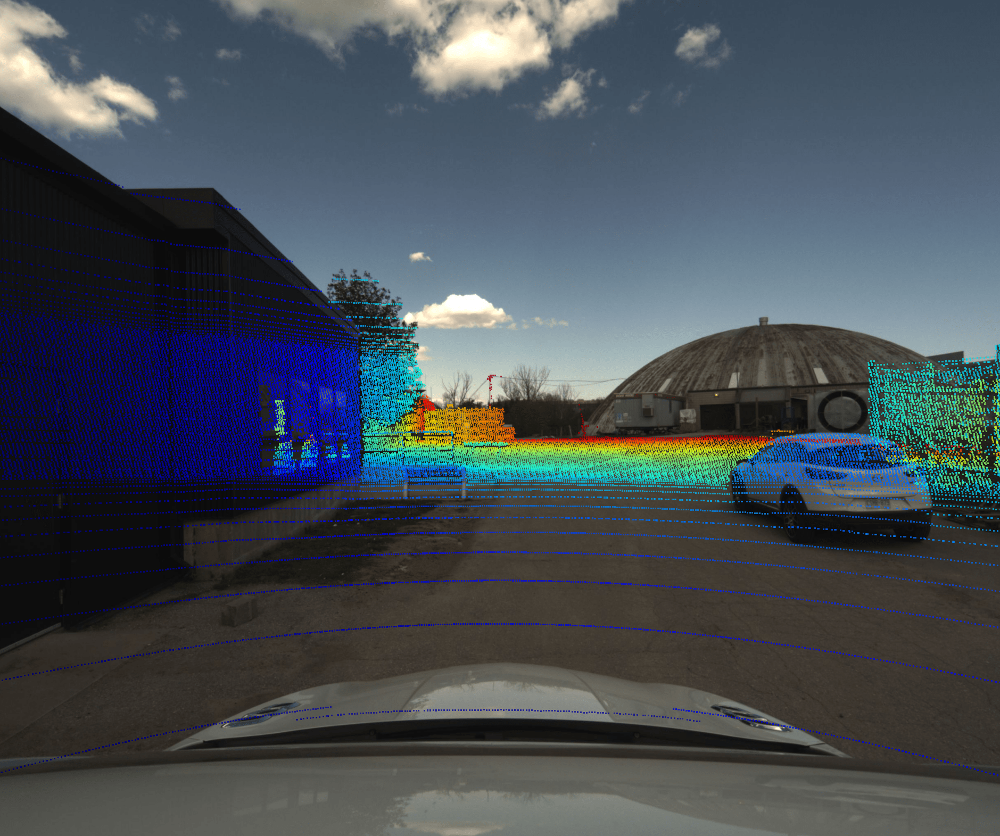

### Lidar-to-Radar Extrinsics
To calibrate the rotation between the lidar and radar, we use correlative scan matching via the Fourier Mellin transform: [git repo](https://github.com/keenan-burnett/radar_to_lidar_calib). Several lidar-radar pairs are collected while the vehicle is stationary in different positions. The final rotation estimate is obtained by avering over several measurements. The results are stored in `T_radar_lidar.txt`.

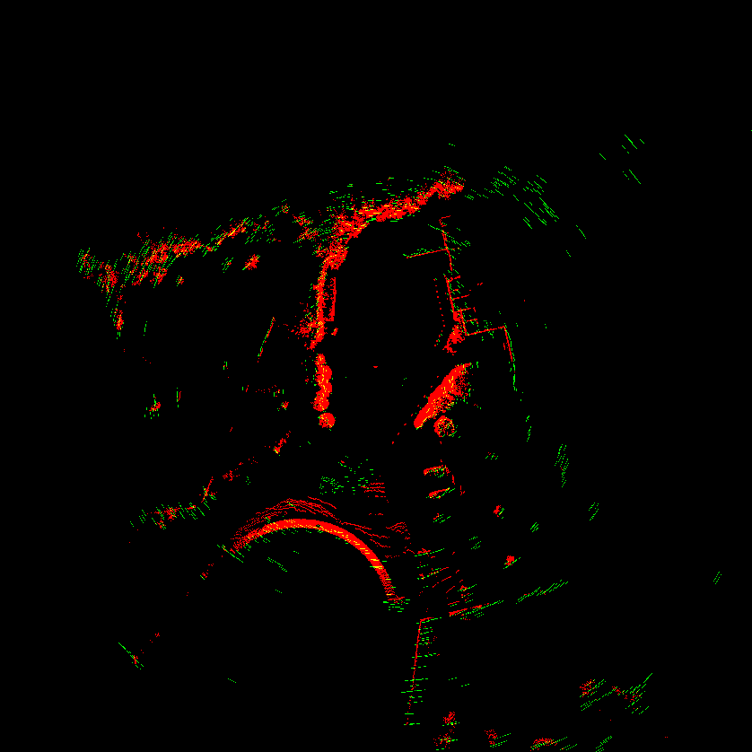

### Lidar-to-IMU Extrinsics
The extrinsics between the lidar and IMU (Applanix reference frame) were obtained by using Applanix's proprietary in-house calibration tools. Their tool estimates this relative transform as a by-product of a batch optimization aiming to estimate the most likely vehicle path given a sequence of lidar pointclouds and post-processed GPS/IMU measurements. The results are stored in `T_applanix_lidar.txt`.

## Applanix Data

Raw GPS position measurements are provided as Latitude, Longitude, and Altitude (LLA). These measurements are provided in the WGS84 standard. The Applanix measurement frame is oriented as shown below:

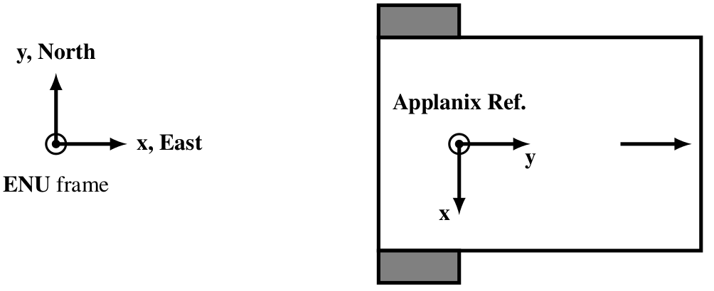

We convert from LLA into a metric coordinate frame, UTM, for this dataset. UTM divides the earth into 60 zones and projects each to a plane as the basis for its coordinates. Converting from LLA to UTM outputs a metric value for Easting and Northing. For our origin frame, we use x-east, y-north, z-up which is abbreviated as ENU.

We use Applanix' proprietary POSPac suite to obtain post-processed results. The POSPac sutie uses all available (GPS, IMU, wheel encoder) data and performs a batch optimization using an RTS smoother to obtain the most accurate orientation, and velocity information at each time step. The RMS position error is typically between 5 and 20 cm. However, this accuracy can change depending on the atmospheric conditions and the visibility of satellites. The accuracy can also change throughout the course of a sequence. For detailed information on the position accuracy of each sequence, we have provided a script, `plot_processed_error.py`, which produces plots of opsition, orientation, and velocity error vs. time.
