# A Guide to the Boreas Road Trip Dataset

## Introduction

Please refer to our paper for all details:
[Boreas Road Trip: A Multi-Sensor Autonomous Driving Dataset on Challenging Roads](https://arxiv.org/abs/2602.16870). You can find a [promotional video summarizing the dataset](https://www.youtube.com/watch?v=zDQVhAOagcU) on our Youtube channel.


### Purpose

The Boreas Road Trip (Boreas-RT) dataset and the associated benchmarks are intended to support odometry, metric localization, and perception algorithms for lidar, radar, and vision.
Boreas-RT features repeated traversals of nine different routes spanning a variety of challenging road conditions, for a total of 643 kilometres of driving.
We argue that state-of-the-art autonomous vehicle (AV) algorithms should be capable of handling all kinds of roads with, ideally, equal performance.
This dataset aims to provide a unified, easy-to-access way for researchers to test their algorithms on both standard and challenging roads using any combination of sensing modalities found in modern AVs.

### Sensors

- 128-beam Velodyne Alpha-Prime 3D lidar
- Aeva Aeries II FMCW Doppler-enabled lidar
- FLIR Blackfly S (5 MP) monocular camera
- Navtech 360 degree RAS6 Doppler-enabled spinning radar
- Silicon Sensing DMU41 IMU
- Dynapar wheel encoder
- Applanix POSLV GNSS

### Data Collection
Data was collected during repeated traversals of nine routes in southern Ontario, Canada, The trajectory and an example video per route can be found below:

<table style="border-collapse: collapse; margin: auto; width: 100%; max-width: 1000px; table-layout: fixed;">
  <!-- Row 1 titles -->
  <tr>
    <td style="border:1px solid #ccc; border-bottom:none; padding:6px 8px;">
      <a href="https://youtu.be/7PQ68cIlalY?si=gCCx-rnJZTCSJ-jl" style="display:block; text-align:center; font-weight:600;">Suburbs</a>
    </td>
    <td style="border:1px solid #ccc; border-bottom:none; padding:6px 8px;">
      <a href="https://youtu.be/-h8O2AdqILk?si=tPgS9cgWibJbxYZa" style="display:block; text-align:center; font-weight:600;">Industrial</a>
    </td>
    <td style="border:1px solid #ccc; border-bottom:none; padding:6px 8px;">
      <a href="https://youtu.be/tNGdWuf9gM4?si=k4b3MtUMExgQKZT_" style="display:block; text-align:center; font-weight:600;">Urban</a>
    </td>
  </tr>

  <!-- Row 1 images -->
  <tr>
    <td style="border:1px solid #ccc; border-top:none; text-align:center; width:33.33%;">
      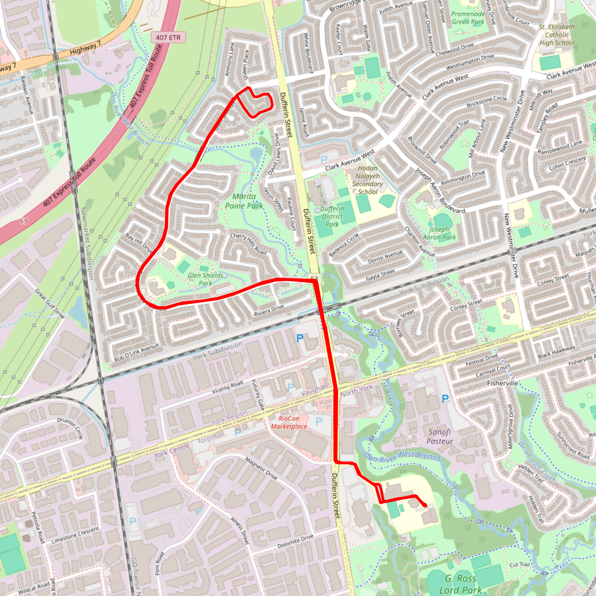
    </td>
    <td style="border:1px solid #ccc; border-top:none; text-align:center; width:33.33%;">
      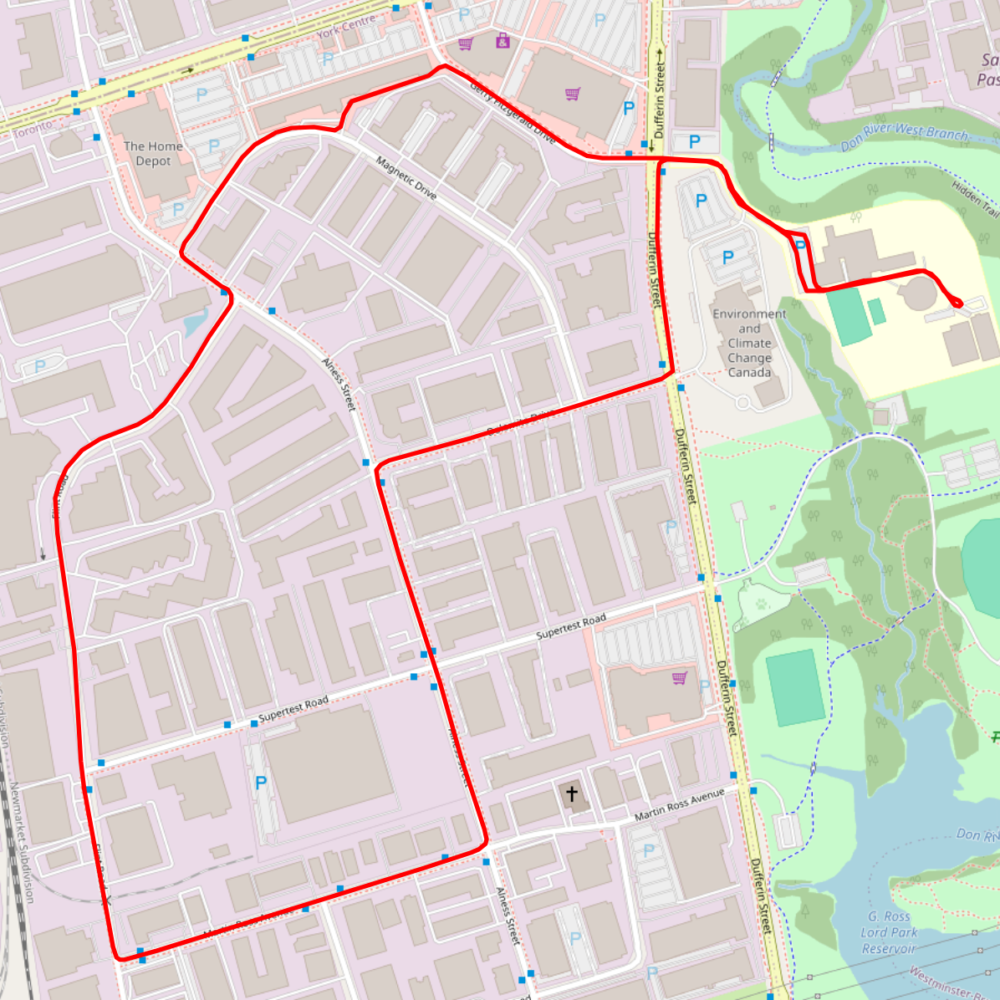
    </td>
    <td style="border:1px solid #ccc; border-top:none; text-align:center; width:33.33%;">
      
    </td>
  </tr>

  <!-- Row 2 titles -->
  <tr>
    <td style="border:1px solid #ccc; border-bottom:none; padding:6px 8px;">
      <a href="https://youtu.be/0W6LdoVtB7U?si=3rui7u_-bviXKZrG" style="display:block; text-align:center; font-weight:600;">Forest</a>
    </td>
    <td style="border:1px solid #ccc; border-bottom:none; padding:6px 8px;">
      <a href="https://youtu.be/xuyYu_tT9jo?si=hSoa_w71WIvd9Xan" style="display:block; text-align:center; font-weight:600;">Farm</a>
    </td>
    <td style="border:1px solid #ccc; border-bottom:none; padding:6px 8px;">
      <a href="https://youtu.be/EbMWZushpig?si=IOEXxJYwQOm9xHgA" style="display:block; text-align:center; font-weight:600;">Tunnel</a>
    </td>
  </tr>

  <!-- Row 2 images -->
  <tr>
    <td style="border:1px solid #ccc; border-top:none; text-align:center;">
      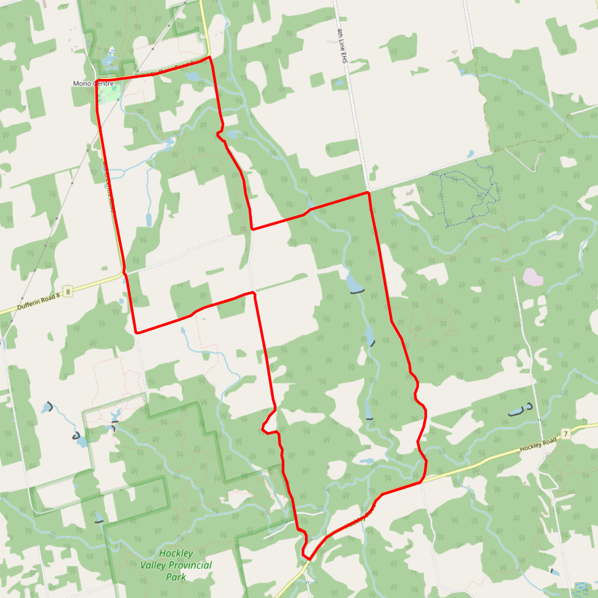
    </td>
    <td style="border:1px solid #ccc; border-top:none; text-align:center;">
      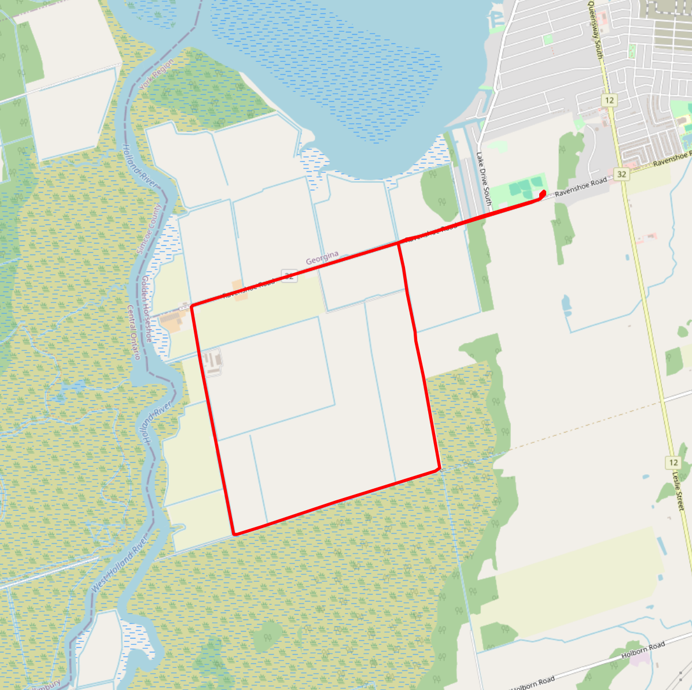
    </td>
    <td style="border:1px solid #ccc; border-top:none; text-align:center;">
      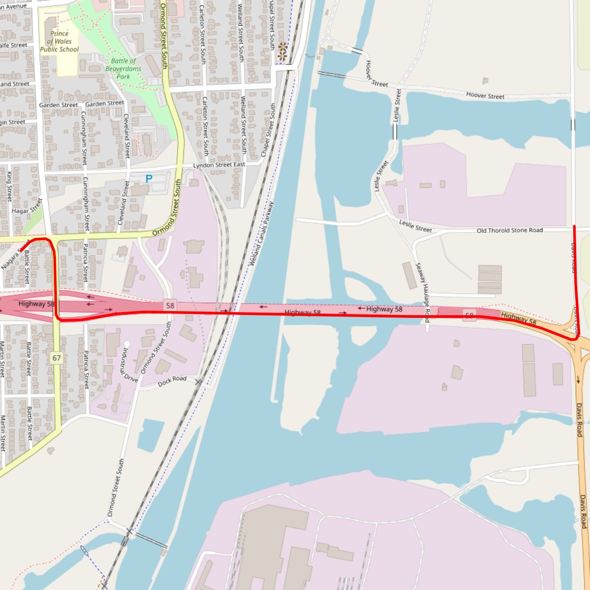
    </td>
  </tr>

  <!-- Row 3 titles -->
  <tr>
    <td style="border:1px solid #ccc; border-bottom:none; padding:6px 8px;">
      <a href="https://youtu.be/0LC4g9NFzGg?si=_CJ09gnBG0McWoLl" style="display:block; text-align:center; font-weight:600;">Skyway</a>
    </td>
    <td style="border:1px solid #ccc; border-bottom:none; padding:6px 8px;">
      <a href="https://youtu.be/pQnh-pLbdeM?si=2sl1SGWnMuIAsz4v" style="display:block; text-align:center; font-weight:600;">Regional</a>
    </td>
    <td style="border:1px solid #ccc; border-bottom:none; padding:6px 8px;">
      <a href="https://youtu.be/iTek5DblFa4?si=3UEmJGQYxo5PZ0o0" style="display:block; text-align:center; font-weight:600;">Freeway</a>
    </td>
  </tr>

  <!-- Row 3 images -->
  <tr>
    <td style="border:1px solid #ccc; border-top:none; text-align:center;">
      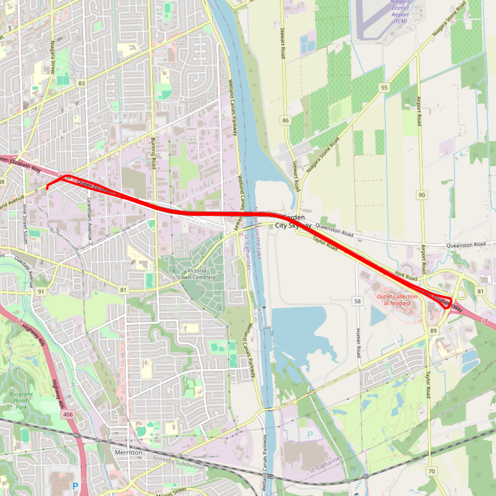
    </td>
    <td style="border:1px solid #ccc; border-top:none; text-align:center;">
      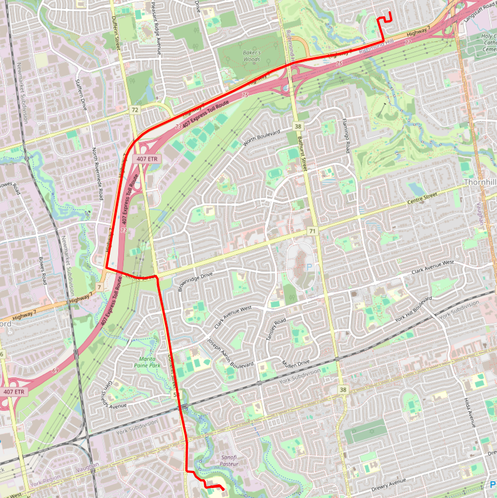
    </td>
    <td style="border:1px solid #ccc; border-top:none; text-align:center;">
      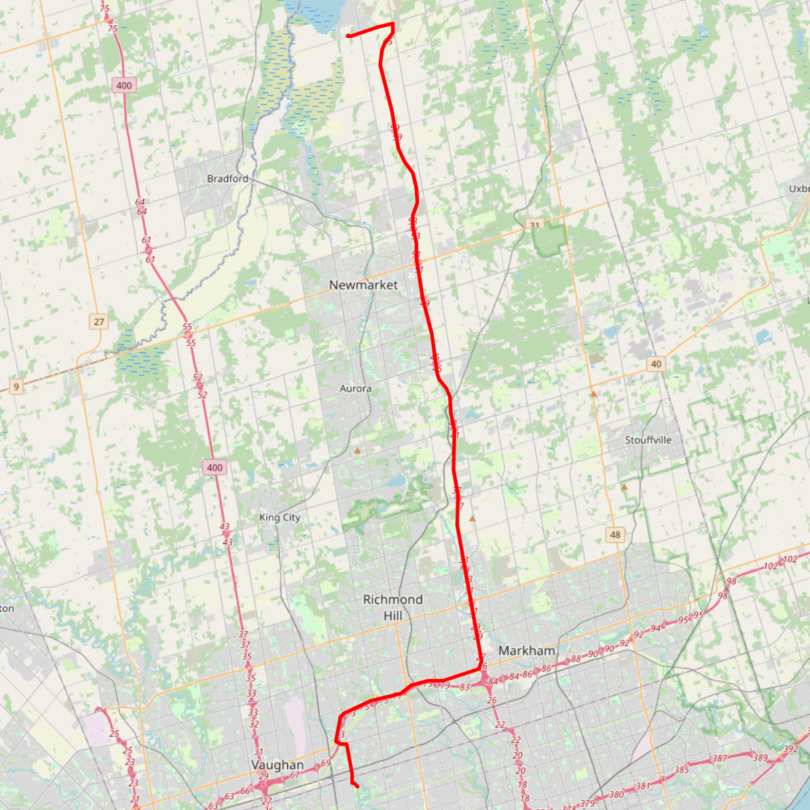
    </td>
  </tr>
</table>


## Sensor Details

### Specifications

| Sensor | Specifications |
|---|---|
| **Applanix POS LV 220 (GNSS-INS)** | • 2–4 cm absolute RTX accuracy (RMS)<br>• 5–10 mm/s velocity accuracy (RMS)<br>• 200 Hz |
| **FLIR Blackfly S Camera (BFS-U3-51S5C)** | • 81° HFOV × 71° VFOV<br>• 2448 × 2048 (5 MP)<br>• 10 Hz |
| **Navtech RAS6 Radar** | • 360° HFOV<br>• 0.0438 m range resolution<br>• 0.9° angular resolution<br>• 300 m range<br>• 4 Hz<br>• Doppler-enabled |
| **Velodyne Alpha-Prime Lidar** | • 360° HFOV × 40° VFOV<br>• 128 beams<br>• 245 m range<br>• ≈ 2.2M points/s<br>• 10 Hz |
| **Aeva Aeries II FMCW Lidar** | • 120° HFOV × 30° VFOV<br>• 500 m range<br>• ≈ 1.0M points/s<br>• 10 Hz<br>• 100 Hz InvenSense IMU (IAM-20680HP)<br>• Provides Doppler velocities |
| **Silicon Sensing DMU41 IMU** | • Angular BI: 0.1 °/hour, RW: 0.02 °/√hour<br>• Linear BI: 15 µg, RW: 0.05 m/s/√hour<br>• Range: ±490 °/s (angular), ±10 g (linear)<br>• 200 Hz |
| **Dynapar Encoder (HS35R)** | • Incremental optical encoder<br>• 1024 pulses per revolution (PPR)<br>• Mounted to rear left wheel |

### Placement

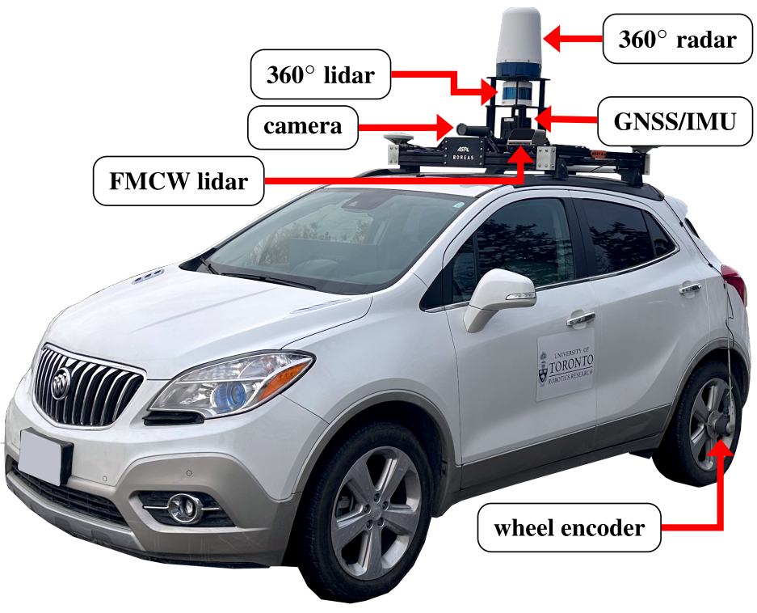

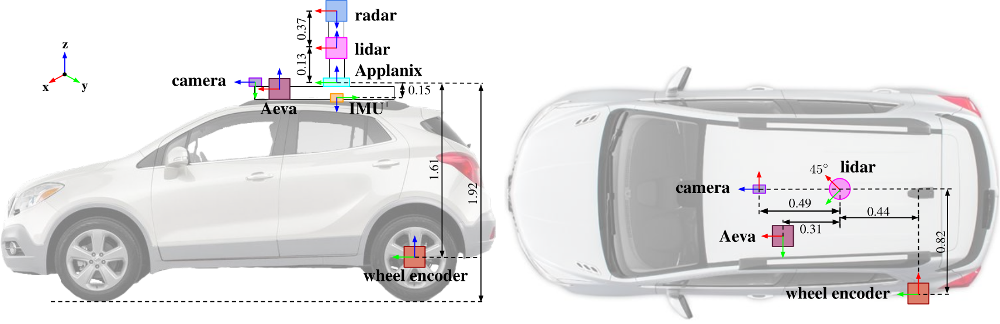

## Data Organization

Each sequence is stored as a folder under a single Amazon S3 bucket and follows the same naming convention: `s3://boreas/boreas-YYYY-MM-DD-HH-MM` denoting the time that data collection started. Below is an overview of the structure of each sequence:

```text
boreas-YYYY-MM-DD-HH-MM
	applanix
		gt_errors.pdf
		gps_post_process.csv
		dmi.csv
		imu.csv
		aeva_poses.csv
		camera_poses.csv
		lidar_poses.csv
		radar_poses.csv
	calib
		misc_calibrations.yaml
		camera0_intrinsics.yaml
		P_camera.txt
		T_applanix_wheel.txt
		T_applanix_dmu.txt
		T_applanix_lidar.txt
		T_camera_lidar.txt
		T_radar_lidar.txt
		T_aeva_lidar.txt
		T_imu_aeva.txt
	imu
		dmu_imu.csv
		dmu_imu_infilled.csv
		aeva_imu.csv
	aeva
		<timestamp>.bin
	camera
		<timestamp>.png
	lidar
		<timestamp>.bin
	radar
		<timestamp>.png
	route.html
	video.mp4
```

Note that the Aeva-related entries are only present in Boreas-RT sequences that contain Aeva data. Please filter by DATASETS/Boreas-RT and TAG/FMCW Lidar to view the available Aeva sequences [on our download page](https://www.boreas.utias.utoronto.ca/#/download).

### Download Instructions
Accessing and downloading the dataset is best done using the AWS CLI.

1. [Create an AWS account (optional)](https://aws.amazon.com/premiumsupport/knowledge-center/create-and-activate-aws-account/)
2. [Install the AWS CLI](https://docs.aws.amazon.com/cli/latest/userguide/install-cliv2.html)
3. Create a `root` folder to store the dataset, example: `/path/to/data/boreas/` Each sequence will then be a folder under `root`.
4. Use the AWS CLI to download either the entire dataset or only the desired sequences and sensors. Add `--no-sign-request` after each of the following commands if you're not going to use an AWS account.

We recommend browsing the sequences [using our download page](https://www.boreas.utias.utoronto.ca/#/download) to pick and choose what data to download.
The website will then generate a list of AWS CLI commands that can be run as a bash script. These commands will look something like:

```bash
root=/path/to/data/boreas/
cd $root
aws s3 sync s3://boreas/boreas-2020-11-26-13-58 ./boreas-2020-11-26-13-58
```
where you will need to modify root to your desired `root` folder before executing the script. The website provides an estimate of the amount of space required in order to download the desired combination of sequences and sensors.

Note that the download page contains both Boreas and Boreas-RT sequences.

## Timestamps
The name of each file corresponds to its timestamp. These timestamps are given as the number of microseconds since January 1st, 1970, in UTC time.

For camera images, timestamps are provided at the time that exposure started plus half of the total exposure time.
For lidar pointclouds, the timestamp corresponds to the temporal middle of a scan.
Each lidar point also has a timestamp associated with it, which corresponds to when each point was measured.
Aeva pointclouds are timestamped according to the temporal start of the scan.
Each aeva point then has an associated timestamp equal to the time difference from the start of the given scan it is associated with.
For radar scans, the timestamp corresponds to the middle of the scan: `floor(M / 2) - 1` where `M` is the total number of azimuths (400).
Each scanned radar azimuth is also timestamped in the same format as the filename.

## Conventions
We follow the convention used at UTIAS for describing rotations, translations, and transformation matrices. See [State Estimation (Barfoot, 2017)](http://asrl.utias.utoronto.ca/~tdb/bib/barfoot_ser17.pdf) for more details.

## File Formats

### Lidar
Lidar pointclouds are stored in a binary format to minimize storage requirements. Each point has six fields: `[x, y, z, i, r, t]` where `(x, y, z)` is the position of the point with respect to the lidar, `i` is the intensity of the reflected infrared signal, `r` is ID of the laser that made the measurement, and `t` is a timestamp. The following code snippet can be used to convert a binary file into a numpy array (N, 6): 

```Python
import numpy as np
from pathlib import Path
def load_lidar(path, dim=6):
    """
    Loads a Velodyne lidar pointcloud (np.ndarray) (N, 6) from path [x, y, z, intensity, laser_number, time]
    Can also be used to load an Aeva lidar pointcloud using dim=10 (np.ndarray) (N, 10) from path [x, y, z, radial velocity, intensity, signal quality, reflectivity, time, point_flags]
    (where pointflags is a float64, so counts as two fields if you're loading 10 fields as float32)
    """
    # dtype MUST be float32 to load this properly!
    points = np.fromfile(path, dtype=np.float32).reshape((-1, dim)).astype(np.float64)
    t = get_time_from_filename(path)
    points[:, -1] += t
    return points
```

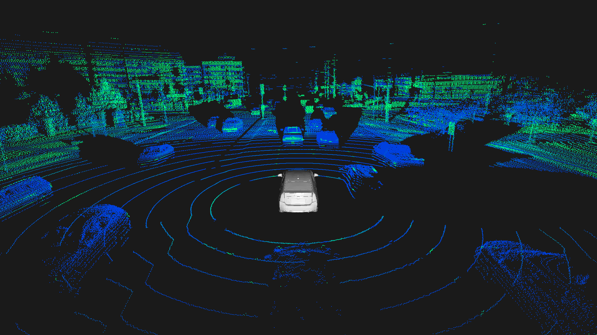

### Aeva
Aeva pointclouds are also stored in a binary format to minimize storage requirements. Each point has six fields: `[x, y, z, v, i, q, r, t, f]` where `(x, y, z)` is the position of the point with respect to the lidar, `v` is the relative radial velocity of the point, `i` is the intensity of the reflected signal, `q` is the signal quality of the return, `r` is the calibrated reflectivity of the detection, `t` is the time offset relative to the temporal start of the scan, and `f` is a 64-bit encoding of per-point flags.
Aeva data can be loaded using the same function as presented for the Velodyne lidar above.


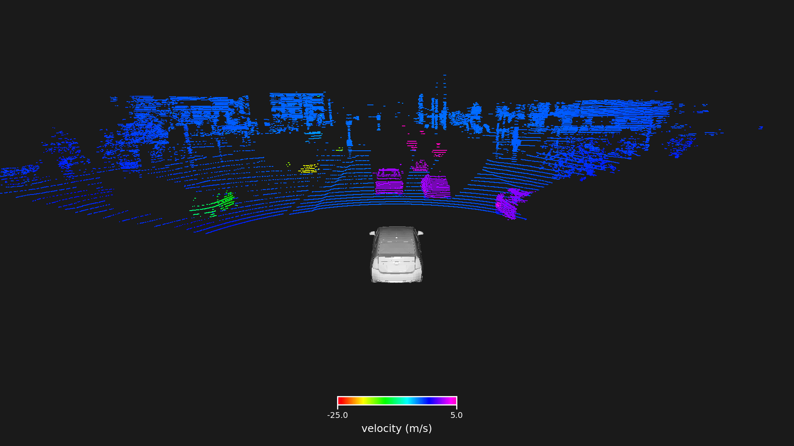

### Radar
Raw radar scans are 2D polar images: `M` azimuths x `R` range bins. We follow Oxford's convention and embed timestamp and encoder information into the first 11 columns (bytes) of each polar radar scan. The first 8 columns represent a 64-bit integer, the UTC timestamp of each azimuth. The next 2 columns represent a 16-bit unsigned integer, the rotational encoder value. The encoder values can be converted into azimuth angles in radians with: `azimuth = encoder * np.pi / 2800`.
The next column is used to store a byte representing whether the radar azimuth was generated using an 'up-chirp' or 'down-chirp'.
The chirp direction corresponds to whether the radar wave was modulated up or down and [can be used to extract the relative Doppler velocity of the objects in the azimuth](https://arxiv.org/abs/2404.01537).
For convenience, we also provide a way to computed a Cartesian representation of each radar scan.

A trimmed polar (left) and Cartesian representation (right) of a radar scan
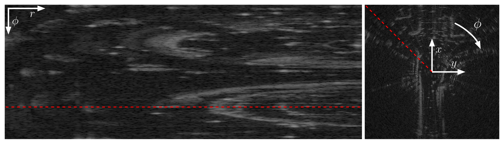


### Camera
Images are simply stored as `png` files. All images are rectified such that a simple projection matrix can be used to project lidar points onto an image.

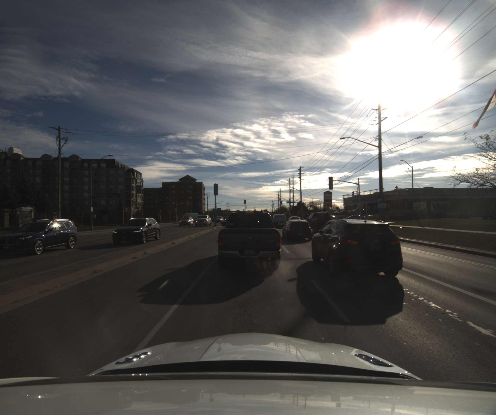

### Pose Files

Ground truth poses are obtained by post-processing GNSS, IMU, and wheel encoder measurements along with corrections obtained from an RTX subscription using Applanix's POSPac software suite. Positions and velocities are given with respect to a fixed East-North-Up frame $ENU_{\text{ref}}$. The position of $ENU_{\text{ref}}$ is aligned with the first pose of the first sequence (`boreas-2020-11-26-13-58`) but the orientation is defined to be tangential to the geoid as defined in the WGS-84 convention such that x points East, y points North, and z points up.

For each sequence, `applanix/gps_post_process.csv` contains the post-processed ground truth in the Applanix frame at 200Hz.

Each sensor frame's pose information is stored in the associated `applanix/<sensor>_poses.csv` file with the following format:

`t, x, y, z, vx, vy, vz, r, p, y, wz, wy, wx` where `t` is the UTC timestamp in microseconds that matches the file name, `(x, y, z)` is the position of the sensor $s$ with repect to $ENU_{\text{ref}}$, as measured in $ENU_{\text{ref}}$ `(vx, vy, vz)` is the velocity of the sensor with respect to $ENU_{\text{ref}}$, `(r, p, y)` are the yaw-pitch-roll angles which can be converted into the rotation matrix from the sensor frame and $ENU_{\text{ref}}$, `(wz, wy, wx)` are the angular velocities of the sensor with respect to $ENU_{\text{ref}}$ as measured in the sensor frame. The pose of the sensor frame is then:

```Python
import numpy as np
from pyboreas.utils.utils import yawPitchRollToRot

def get_pose(x, y, z, r, p, y):
	T_enu_sensor = np.identity(4, dtype=np.float64)
	C_enu_sensor = yawPitchRollToRot(y, p, r)
	T_enu_sensor[:3, :3] = C_enu_sensor
	r_sensor_enu_in_enu = np.array([x, y, z]).reshape(3,1)
	T_enu_sensor[:3, 3:] = r_sensor_enu_in_enu
	return T_enu_sensor

# Linear and angular velocities
v_sensor_enu_in_enu = [vx, vy, vz]
w_sensor_enu_in_sensor = [wx, wy, wz]
```
<!-- 
We also provide an `imu.csv` file which can be used to improve odometry or localization performance as desired. This data is provided in the applanix reference frame. Each line in the file has the following format: `t, wz, wy, wx, az, ay, ax` where `(t, wz, wy, wz)` have the same format as above, and `(az, ay, ax)` are the linear acceleration values as defined in the applanix sensor frame. We also provide Note that the data contained in `imu.csv` is extraced from the post-processed Applanix solution. In order to enable researchers to work on visual-inertial or lidar-inertial systems, we also provide `imu_raw.csv` which is extracted from the raw Applanix logs. The `imu_raw.csv` files have the same format except **they are in the IMU body frame which is defined as x-backwards, y-left, z-up**. We further provide `dmi.csv` which provides the wheel encoder ticks vs. time. Note that the lever arms between the DMI and the applanix reference frame are x=-0.65m, y=-0.77m, z=1.80m.

## Synchronization and Calibration

### Synchronization
The camera was configured to emit a square-wave pulse where the rising edge of each pulse corresponds to the start of a new camera exposure event. The Applanix receiver was then configured to receive and timestamp these event signals. The Velodyne lidar was synchronized to UTC time using a hardwired connection to the Applanix sensor carrying NMEA data and PPS signals. The data-recording computer was synchronized to UTC time in the same fashion. The Navtech radar synchronizes its local clock to the NTP time broadcasted on its ethernet subnet. Since the computer publishing the NTP time is synchronized to UTC time, the radar is thereby also synchronized to UTC time.

### Camera Intrinsics
Camera intrinsics are calibrated using [MATLAB's camera calibrator](https://www.mathworks.com/help/vision/ug/using-the-single-camera-calibrator-app.html) and are recorded in `camera0_intrinsics.yaml`. Images in the dataset have already been rectified and as such, the intrinsics parameters can be ignored for most applications. The rectified matrix `P`, stored in `P_camera.txt`, can then use used to project points onto the image plane.

### Lidar-to-Camera Extrinsics
The extrinsic calibration between the camera and lidar is obtained using [MATLAB's camera to LIDAR calibrator](https://www.mathworks.com/help/lidar/ug/lidar-and-camera-calibration.html). The results are stored in `T_camera_lidar.txt`.

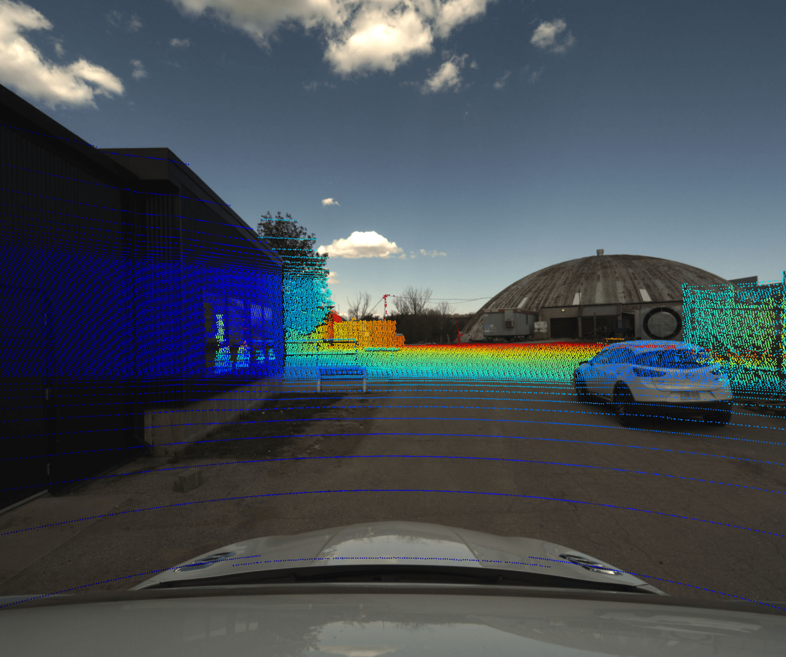

### Lidar-to-Radar Extrinsics
To calibrate the rotation between the lidar and radar, we use correlative scan matching via the Fourier Mellin transform: [git repo](https://github.com/keenan-burnett/radar_to_lidar_calib). Several lidar-radar pairs are collected while the vehicle is stationary in different positions. The final rotation estimate is obtained by averaging over several measurements. The results are stored in `T_radar_lidar.txt`.

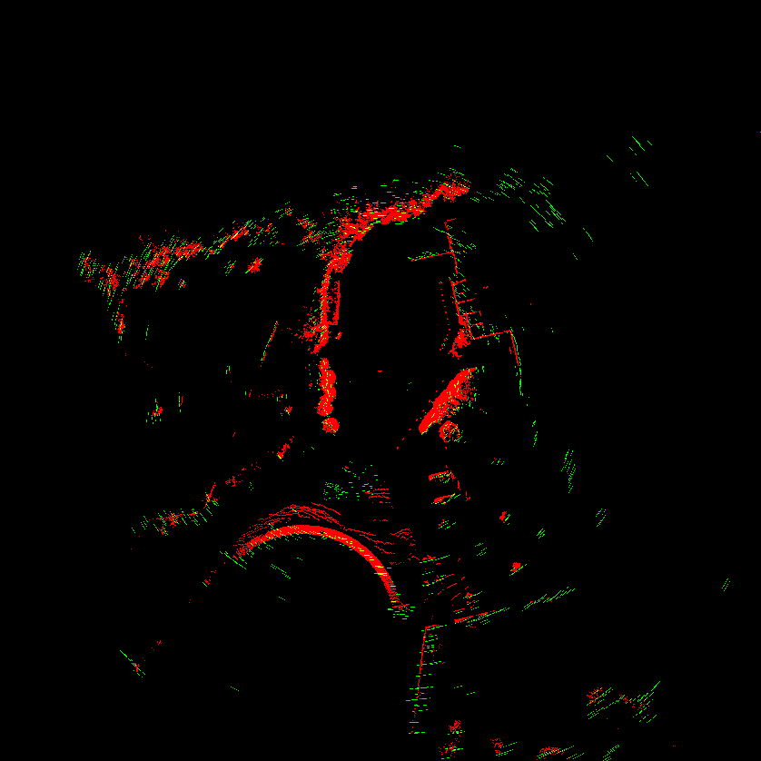

### Lidar-to-IMU Extrinsics
The extrinsics between the lidar and IMU (Applanix reference frame) were obtained by using Applanix's proprietary in-house calibration tools. Their tool estimates this relative transform as a by-product of a batch optimization aiming to estimate the most likely vehicle path given a sequence of lidar pointclouds and post-processed GPS/IMU measurements. The results are stored in `T_applanix_lidar.txt`.

## Applanix Data

We use Applanix's proprietary POSPac suite to obtain post-processed results. The POSPac suite uses all available (GPS, IMU, wheel encoder) data and performs a batch optimization using an RTS smoother to obtain the most accurate orientation, and velocity information at each time step. The RMS position error is typically 2-4 cm. However, this accuracy can change depending on the atmospheric conditions and the visibility of satellites. The accuracy can also change throughout the course of a sequence. For detailed information on the position accuracy of each sequence, we have provided a script, `plot_processed_error.py`, which produces plots of position, orientation, and velocity residual error vs. time.  -->