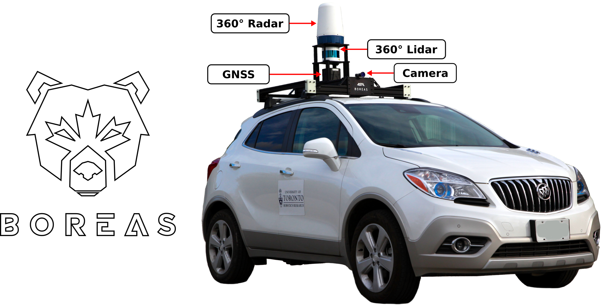

# boreas-devkit


This package contains tools for working with the Boreas dataset.

## Installation

### Using pip
```
pip install asrl-pyboreas
```

### From source
```
git clone https://github.com/utiasASRL/pyboreas.git
pip install -e pyboreas
```

## Download Instructions
1. [Create an AWS account](https://aws.amazon.com/premiumsupport/knowledge-center/create-and-activate-aws-account/)
2. [Install the AWS CLI](https://docs.aws.amazon.com/cli/latest/userguide/install-cliv2.html)
3. Create a `root` folder to store the dataset, example: `/path/to/data/boreas/` Each sequence will then be a folder under `root`.
4. Use the AWS CLI to download either the entire dataset or only the desired sequences and sensors. For example, the following command will download the entire Boreas dataset:

```bash
root=/path/to/data/boreas/
aws s3 sync s3://boreas $root
```

Alternatively, [our website (Work-In-Progress)](boreas.utias.utoronto.ca/#/download) can be used to browse through sequences so as to pick and choose what data to download. The website will then generate a list of AWS CLI commands than can be run as a bash script. These commands will look something like:

```bash
root=/path/to/data/boreas/
cd $root
aws s3 sync s3://boreas/boreas-2020-11-26-13-58 . --exclude "*" \
    --include "lidar/" --include "radar/" \
    --include "applanix/" --include "calib/"
```

The folder structure should end up looking like:
```
$ ls /path/to/data/boreas/
boreas-2020-11-26-13-58
boreas-2020-12-01-13-26
...
$ ls /path/to/data/boreas/boreas-2020-11-26-13-58
applanix calib camera lidar radar
```

## Example Usage

```Python
from pyboreas import BoreasDataset

root = '/path/to/data/boreas/'
boreas = BoreasDataset(root)

# Each sequence contains camera, lidar, radar sensor frames and
# has it's own calibration. Each sensor frame contains a
# timestamp, ground truth pose (4x4 homogeneous transform) wrt a
# global coordinate frame, and velocity information.

# TODO: transform lidar data at a time into camera at a time

# Loop through each frame in order (odometry)
for seq in boreas.sequences:
    # Generator examples:
    for camera_frame in seq.camera:
        img = camera_frame.img  # np.ndarray
        # do something
        pass
    for lidar_frame in seq.lidar:
        pts = lidar_frame.points  # np.ndarray
        # do something
        pass
    # Retrieve frames based on their index:
    N = len(seq.radar_frames)
    for i in range(N):
        radar_frame = seq.get_radar(i)
        # do something

# Randomly access frames (deep learning, localization):
N = len(boreas.camera_frames)
indices = np.random.permutation(N)
for idx in indices:
    camera_frame = boreas.get_camera(idx)
    # do something

# Calibration

# Pose

# Timestamp
```

TODO:

- [ ] Tutorial
- [ ] Convert readme pdf to markdown
- [ ] Doc strings
- [ ] PEP8 formatting
- [ ] Ground plane removal
- [ ] Pointcloud voxelization
- [ ] 3D Bounding boxes
- [ ] Verbosity levels for class initialization
